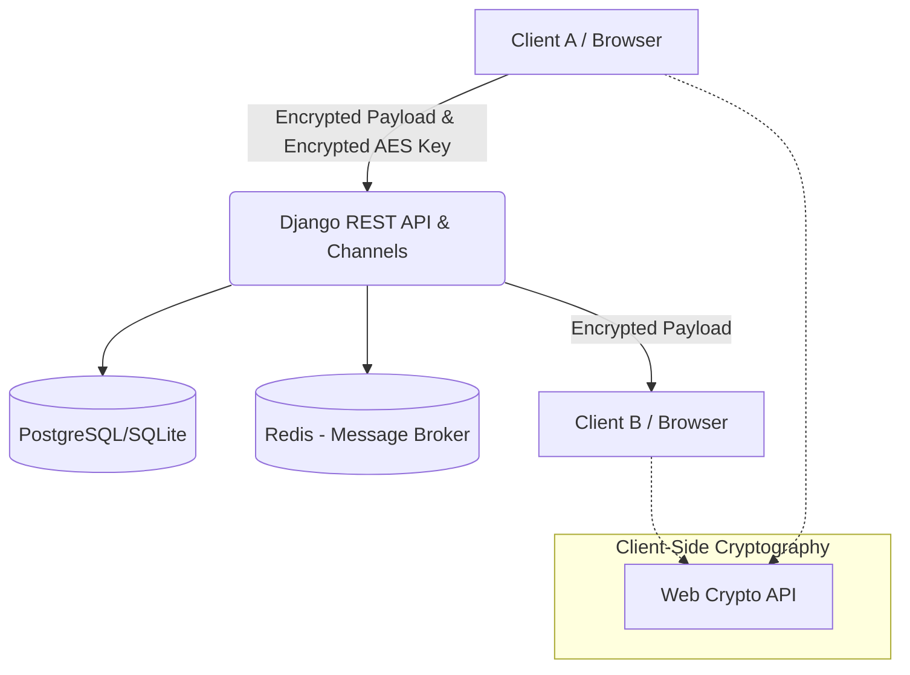

# BurnVault - Deliverable 1 Report
**Course:** Secure Software Development (CY321)

## 1. Security Requirements and Planning
BurnVault is a secure, ephemeral communication platform designed with a zero-knowledge architecture. The primary objective is to allow users to send encrypted messages and files that are automatically deleted after reading/downloading. 

### Security Requirements:
- **Confidentiality:** All messages and files must be end-to-end encrypted. The server must never have access to plaintext data or private keys.
- **Integrity:** Data in transit must be protected against tampering. Authenticated encryption (e.g., AES-GCM) should be used.
- **Availability:** The system should securely handle user sessions and provide reliable delivery of messages via WebSockets and REST APIs.
- **Authentication:** Stateless, secure JWT-based authentication must be implemented for API access.
- **Non-Repudiation:** Asymmetric cryptography (RSA) will be used to encrypt symmetric keys, ensuring that only the intended recipient can decrypt the payload.
- **Data Minimization & Ephemerality:** Messages must be permanently deleted from the database immediately after being read (Burn-on-read). Files must be deleted immediately after download.

## 2. Risk Management
| Risk | Likelihood | Impact | Mitigation Strategy |
|------|------------|--------|---------------------|
| Server Compromise | Medium | High | **Zero-Knowledge Architecture:** The server only stores encrypted ciphertexts. Private keys are encrypted on the client side using the user's password before being stored. |
| Man-in-the-Middle (MitM) | Low | High | **E2E Encryption & HTTPS:** All payloads are encrypted on the client before transmission. TLS/HTTPS will be enforced in production to protect transit. |
| Cross-Site Scripting (XSS) | Medium | High | **Content Security Policy (CSP):** Strict CSP headers. Django templates will automatically escape HTML. No inline scripts allowed. |
| Brute Force / Credential Stuffing | Medium | Medium | **Rate Limiting & Strong Password Policies:** Implement rate limiting on login endpoints. Enforce password complexity. |
| Data Leakage via Browser Cache | Low | Medium | **Ephemeral UI Design:** Clear sensitive data from memory when navigating away. Disable context menus and caching for sensitive routes. |

## 3. Threat Modeling

### System Architecture Diagram

### STRIDE Threat Model Analysis
- **Spoofing:** Handled via robust JWT authentication and user session management.
- **Tampering:** Mitigated using AES-256-GCM, which provides both encryption and integrity checking.
- **Repudiation:** JWT tokens securely identify the sender of every API request.
- **Information Disclosure:** Prevented by End-to-End Encryption (E2EE). The server database contains only encrypted blobs.
- **Denial of Service (DoS):** Mitigated through API rate limiting and Redis-backed WebSocket connection management.
- **Elevation of Privilege:** Django's robust permission classes and object-level permissions ensure users can only access their own encrypted messages.

### Security Controls
1. **Cryptography:** `Web Crypto API` on the client side (AES-256-GCM and RSA-2048-OAEP).
2. **Authentication:** `rest_framework_simplejwt` with short-lived access tokens and refresh token rotation.
3. **Database Security:** Parameterized queries via Django ORM (prevents SQL Injection).
4. **Network Security:** CORS restrictions, secure WebSocket (`wss://`) handling, and HTTP-only cookies in production.
